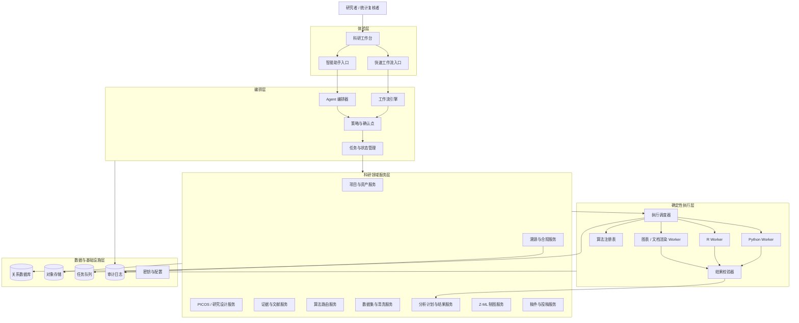
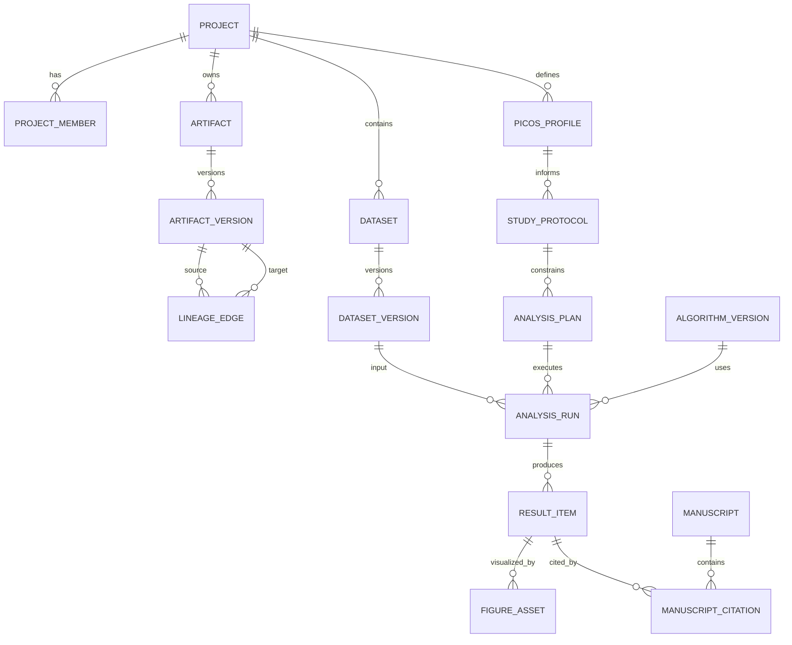

# 掌术 AI 科研工作站：系统架构设计

> 文档版本：v1.0  
> 配套文档：[《掌术 AI 科研工作站：功能规划 PRD》](掌术AI科研工作站_功能规划PRD.md) v4.0  
> 架构阶段：MVP 目标架构  
> 核心约束：统计结果由确定性执行器产生；AI 不得生成正式统计数值

---

## 1. 架构目标

系统需要同时支持科研探索的开放性与统计执行的确定性。架构的首要任务不是堆叠 Agent，而是建立一套稳定的科研资产、执行和溯源底座，使工作流入口与 Agent 入口可以安全地复用相同能力。

### 1.1 质量属性优先级

1. **正确性**：统计方法、输入、参数与输出之间具有明确契约。
2. **可追溯**：正式结果可回溯到数据版本、算法版本和运行实例。
3. **可复现**：保存代码、环境、随机种子和依赖锁定信息。
4. **安全性**：医疗数据本地优先、最小权限、全量审计。
5. **可扩展**：新增研究设计、算法、图表或稿件模板不改动主流程。
6. **可用性**：长任务可观察、可取消、可恢复，失败不污染有效产物。

### 1.2 架构原则

- **双入口、单内核**：工作流与 Agent 只负责不同的交互和编排，不复制领域逻辑。
- **LLM 与计算隔离**：LLM 不能直接写入“已验证结果”，只能调用受控工具。
- **产物驱动**：模块通过版本化科研产物衔接，不依赖聊天文本传递关键事实。
- **不可变运行**：数据版本、分析运行和正式结果一旦登记不原地覆盖。
- **契约优先**：算法输入输出、Agent 工具和模块 API 均采用结构化 Schema。
- **先模块化单体、后按负载拆分**：MVP 避免过早微服务化，但统计执行器必须进程隔离。

---

## 2. 系统上下文

### 2.1 参与者

| 参与者 | 权限与职责 |
|---|---|
| 研究者 | 创建项目、上传数据、确认方法、审阅结果、导出成果 |
| 统计复核者 | 查看分析计划、参数、诊断、代码和运行记录，批准结果 |
| 项目管理员 | 管理成员、权限、数据策略和项目归档 |
| 平台管理员 | 管理算法、模板、期刊规则、模型和运行环境版本 |

### 2.2 外部系统

| 系统 | 用途 | 边界要求 |
|---|---|---|
| LLM 服务 | 意图理解、文本生成、结果解释 | 只接收授权上下文；输出视为不可信建议 |
| 文献与题录源 | DOI/元数据/证据获取 | 保存来源、时间和许可信息 |
| 期刊规则库 | 格式与投稿要求 | 规则版本化并显示更新时间 |
| Python/R 运行环境 | 统计分析与制图 | 沙箱隔离、固定依赖、资源限额 |
| 文件导出组件 | Word/LaTeX/PDF/SVG 等 | 不得绕过溯源与合规检查 |

---

## 3. 总体架构



### 3.1 分层职责

| 层 | 负责 | 不负责 |
|---|---|---|
| 体验层 | 项目导航、表单、聊天、确认、结果审阅 | 统计计算和业务规则 |
| 编排层 | 步骤组织、工具调用、状态推进、人工中断 | 直接操作数据库或计算数值 |
| 领域服务层 | PICOS、数据、分析、稿件等核心规则 | 执行不受控代码 |
| 确定性执行层 | 清洗、统计、机器学习、渲染和验证 | 生成研究结论或修改稿件 |
| 数据基础设施层 | 持久化、队列、审计、密钥与文件 | 承载用户交互逻辑 |

---

## 4. 模块划分

### 4.1 项目与科研资产服务

负责项目、成员、权限、科研产物、版本和依赖关系。所有跨功能传递的信息必须先登记为资产。

核心能力：

- 创建、冻结、派生和归档资产版本。
- 维护资产之间的 `derived_from`、`uses`、`cites`、`supersedes` 关系。
- 为正式导出生成项目快照和 manifest。

### 4.2 PICOS 与研究设计服务

- 维护 12 类研究设计的定义、字段 Schema 和约束规则。
- 校验结构化 PICOS；保存 AI 抽取值、证据片段、置信度和用户确认值。
- 调用样本量计算器，但不允许 LLM 直接生成正式样本量。
- 输出版本化 Study Protocol，供路由、分析和写作复用。

### 4.3 证据与文献服务

- 管理文献文件、题录、DOI、解析文本和证据卡片。
- 将事实陈述绑定到文献位置，区分原文事实、综合结论和 AI 推断。
- 为稿件提供可验证引用，不允许 Agent 直接构造不存在的参考文献。

### 4.4 算法路由服务

路由服务是前置 AI 与中段算法的边界中枢，输入为已确认的研究设计、分析目标和数据画像，输出为候选分析计划。

路由分三层：

1. **硬约束过滤**：研究设计、结局类型、变量类型、样本结构和执行器可用性。
2. **适用性排序**：数据分布、样本量、缺失情况、方法假设和用户目标。
3. **解释与替代**：主推荐、备选方案、不适用原因和预期输出。

LLM 可以生成易读解释，但推荐集合必须由规则和算法注册表约束。

### 4.5 数据集与清洗服务

- 原始数据集只读，清洗产生新的 Dataset Version。
- 数据画像、数据字典、缺失模式、逻辑校验和敏感字段标签均作为独立资产保存。
- 清洗策略先生成 Change Set，用户确认后才交执行器应用。
- 记录行级/字段级影响摘要；敏感场景可只保存差异统计，不保留明细日志。

### 4.6 分析计划与结果服务

- 管理 Analysis Plan、Analysis Run、Result Bundle 和审核状态。
- 运行前检查变量映射、参数、前提假设、执行器能力和数据版本。
- 运行后通过结果校验器，将原始输出标准化成统一指标 Schema。
- 只有通过机器校验，并在需要时经人工复核的结果，才能成为 Verified Result。

### 4.7 Z-ML 制图服务

- 根据 Result Bundle 和 Plot Spec 生成绘图任务。
- 模板负责期刊尺寸、字体、配色和布局，执行器负责真实渲染。
- 图表中的每组数据、标注和统计量保存 result reference。
- 自动重拟合只处理布局、标签和样式，不改变统计数据。

### 4.8 稿件与投稿服务

- 将 PICOS、方案、证据、已验证结果和图表组合为 Manuscript Context。
- 按章节生成草稿并保存每段引用的资产 ID。
- 正式导出前运行数值溯源、引文完整性、结构和期刊规则检查。
- 选刊结果必须携带外部数据来源和更新时间。

### 4.9 溯源与合规服务

提供统一的防幻觉闸门：

- 检查稿件数值是否命中 Verified Result。
- 检查图表是否引用同一项目和允许的数据版本。
- 检查引用是否存在于 Evidence Set。
- 对越权数据访问、未确认的高风险操作和不完整导出进行阻断。

---

## 5. 双入口编排设计

### 5.1 快速工作流

工作流由版本化定义驱动，每个节点声明输入 Schema、执行动作、输出 Schema、重试策略和确认策略。

```text
接收结构化输入
  → Schema 校验
  → 调用领域服务
  → 必要时创建执行任务
  → 人工确认节点
  → 登记产物
  → 触发可选下游
```

适用于批量、稳定、可预测的路径。同一版本工作流在相同输入下应得到相同的编排决策。

### 5.2 智能助手

Agent 负责理解意图、补齐信息、选择被授权的工具和解释结果。Agent 不能拥有绕过领域服务或直接写数据库的能力。

```text
自然语言意图
  → 结构化意图与缺失字段
  → 读取项目上下文
  → 生成候选行动计划
  → 策略引擎校验
  → 用户确认高风险动作
  → 调用与工作流相同的领域工具
  → 用资产引用组织答复
```

### 5.3 统一工具契约

每个 Agent 工具同时也是工作流可调用能力，至少声明：

- `name` 与版本；
- 输入、输出 JSON Schema；
- 所需权限与数据范围；
- 幂等键；
- 是否产生费用、写入或长任务；
- 是否需要人工确认；
- 超时、重试和补偿策略；
- 可审计摘要字段。

### 5.4 风险分级

| 等级 | 示例 | 策略 |
|---|---|---|
| R0 只读 | 查看资产、解释结果 | 可直接执行并审计 |
| R1 可撤销写入 | 保存草稿、创建计划 | 执行后通知，可版本回退 |
| R2 数据/计算变更 | 应用清洗、启动分析、调整模型 | 执行前明确确认 |
| R3 正式外发 | 导出正式稿、发布或对外提交 | 强确认、权限校验、合规闸门 |

---

## 6. 核心数据模型

### 6.1 实体关系



### 6.2 关键对象

| 对象 | 必要字段 |
|---|---|
| Dataset Version | ID、父版本、文件哈希、数据字典、敏感级别、创建者 |
| PICOS Profile | 五要素、来源、置信度、确认状态、版本 |
| Analysis Plan | 研究设计、目标、变量映射、方法、参数、推荐理由、确认人 |
| Analysis Run | 输入版本、计划版本、算法版本、环境、种子、状态、日志 |
| Result Item | 指标名、值、单位、CI、P 值、标准化类型、run_id、校验状态 |
| Figure Asset | plot spec、结果引用、代码、渲染环境、文件哈希 |
| Manuscript Citation | 文稿位置、类型、目标资产、展示文本 |

### 6.3 结果引用

稿件中不得只保存展开后的数字，应同时保存机器可读引用，例如：

```json
{
  "display": "HR 0.72 (95% CI 0.58–0.89; P=0.002)",
  "result_ref": {
    "project_id": "prj_123",
    "run_id": "run_456",
    "result_id": "res_789",
    "result_version": 1
  }
}
```

导出时由溯源服务重新解析引用并核对展示值，避免文稿修改后数值与结果脱节。

---

## 7. 算法注册表与执行框架

### 7.1 算法注册表

每个算法不是一个名称，而是一个可验证、可调度的版本化能力单元。

必备元数据：

- 算法 ID、方法族、版本和状态；
- 支持的研究设计、分析目标和变量类型；
- 输入/参数/输出 Schema；
- 前提假设和前置检查；
- Python/R 镜像、入口命令与依赖锁；
- 资源要求、超时和并发限制；
- 验证数据集、参考结果和误差容限；
- 替代算法、已知限制和上线等级。

状态建议：`draft → validated → available → deprecated → retired`。PRD 中的“已实现”只有在 `validated` 后才成立。

### 7.2 执行生命周期

```text
DRAFT
  → VALIDATING_INPUT
  → WAITING_CONFIRMATION
  → QUEUED
  → RUNNING
  → VALIDATING_OUTPUT
  → SUCCEEDED
  → REVIEWED
  → VERIFIED
```

异常终态：`CANCELLED`、`TIMED_OUT`、`FAILED`、`REJECTED`。失败运行保留日志但不能产生已验证结果。

### 7.3 执行隔离

- 每个任务在固定版本的容器或等价隔离环境中运行。
- 默认禁用公网访问；如算法需要外部数据，使用受控数据连接器。
- 设置 CPU、内存、磁盘、运行时长和输出大小限制。
- 禁止将用户生成的任意代码直接交给宿主机执行。
- Python 与 R 输出先进入暂存区，经 Schema 与数值校验后再登记。

### 7.4 结果验证

结果校验至少包括：

- 输出字段、类型、单位和范围检查；
- NaN/Inf、收敛、样本量和假设诊断；
- 关键统计量之间的一致性检查；
- 与参考软件或黄金数据集的回归测试；
- 图表引用结果与源 Result Item 一致性检查。

---

## 8. 任务、事件与状态

### 8.1 异步任务

清洗、分析、制图、文档渲染和大批量文献解析统一使用异步任务模型。

任务必须支持：进度、心跳、取消、超时、有限重试、幂等提交、失败原因和产物链接。

### 8.2 领域事件

建议使用事务内事件表（Outbox）保证数据库状态与事件一致。核心事件包括：

- `PicosConfirmed`
- `DatasetVersionCreated`
- `AnalysisPlanApproved`
- `AnalysisRunSucceeded`
- `ResultVerified`
- `FigureRendered`
- `ManuscriptCompliancePassed`

MVP 内部可使用进程内事件加 Outbox，不要求立即引入分布式事件总线。

### 8.3 幂等与补偿

- 写操作携带幂等键，重复请求不得重复创建运行或计费。
- 运行取消只停止未完成任务，不删除已有日志。
- 数据清洗不做反向修改，通过切换 Dataset Version 实现回滚。
- 文稿修改形成新版本；正式导出绑定不可变项目快照。

---

## 9. 存储设计

| 存储 | 内容 | 设计要点 |
|---|---|---|
| 关系数据库 | 项目、权限、Schema、运行、结果、溯源 | 强事务、版本字段、软删除限制 |
| 对象存储 | 原始数据、派生数据、PDF、图表、导出文件 | 内容哈希、加密、生命周期策略 |
| 任务队列 | 分析、渲染、解析任务 | 可见性超时、死信队列、优先级 |
| 审计日志 | 用户、Agent、系统和管理员操作 | 追加写、不可篡改、关联 trace_id |
| 缓存 | 只读元数据、模板和短期会话 | 不作为科研事实的唯一存储 |

向量检索可用于文献与项目语义检索，但向量库只保存索引与引用，权威内容仍在对象存储和关系数据库中。

---

## 10. API 与服务边界

### 10.1 API 风格

- 面向体验层提供项目化 REST/JSON API；长任务返回 task ID。
- 进度使用 Server-Sent Events 或 WebSocket 推送。
- 内部执行器通过受控任务消息接收不可变运行清单。
- 所有响应包含 `request_id`；科研写操作同时包含 `artifact_id/version` 或 `run_id`。

### 10.2 核心 API 资源

```text
/projects
/projects/{id}/artifacts
/projects/{id}/picos-profiles
/projects/{id}/datasets/{datasetId}/versions
/projects/{id}/analysis-plans
/analysis-runs
/analysis-runs/{id}/results
/figures
/manuscripts
/exports
/tasks
```

### 10.3 边界约束

- Agent 只访问工具网关，不直接访问数据库或对象存储。
- 执行器只读取运行清单授权的数据版本，只能写入本次任务暂存区。
- 导出服务只能读取通过合规闸门的项目快照。

---

## 11. 安全与合规

### 11.1 数据分级

建议至少划分：公开资料、项目内部、敏感科研数据、可识别医疗数据。不同级别决定模型调用、日志记录、导出和存储策略。

### 11.2 访问控制

- 采用项目级 RBAC，并在数据集和正式导出上增加细粒度策略。
- 后端对每次工具调用重新鉴权，不信任前端或 Agent 声明。
- 管理员不能默认读取项目医疗数据，运维访问采用临时授权并审计。

### 11.3 LLM 数据边界

- 向外部模型发送内容前执行敏感字段检测和策略判定。
- 尽量发送结构摘要或脱敏片段，不发送完整数据集。
- Prompt、模型、参数、工具调用和输出均记录版本；敏感原文按策略脱敏后审计。
- 模型输出必须经过结构校验、引用校验和业务规则校验。

### 11.4 审计

审计事件至少包含操作者、角色、项目、动作、对象、前后版本、时间、来源、模型/工具版本、结果和 trace ID。

---

## 12. 可观测性与运维

### 12.1 三类可观测数据

- **技术指标**：延迟、错误率、队列深度、资源利用率和执行器可用性。
- **科研质量指标**：算法校验失败率、假设违规率、结果复核驳回率和溯源覆盖率。
- **Agent 指标**：工具选择成功率、Schema 失败率、越权拦截、确认点转化和 token/费用。

### 12.2 全链路追踪

一次用户操作生成统一 trace ID，贯穿 UI、编排器、领域服务、任务队列、执行器、结果和导出。用户侧展示可理解的时间线，运维侧保留技术详情。

### 12.3 备份与恢复

- 数据库执行定期备份和时间点恢复验证。
- 对象存储开启版本或等价保护，项目归档生成完整 manifest。
- 恢复演练必须验证资产关系和结果引用，而不只是文件存在。

---

## 13. 部署架构

### 13.1 MVP 推荐形态

采用“模块化应用服务 + 隔离执行 Worker”的形态：

```text
Web 应用
  → 应用/API 服务（模块化单体）
      → 关系数据库 / 对象存储 / 队列
      → Agent/LLM 网关
      → Python Worker 池
      → R Worker 池
      → 图表与文档渲染 Worker
```

原因：业务边界尚在快速演化，模块化单体更利于保持事务和开发效率；统计任务依赖复杂、耗时且风险高，因此从第一天就与应用进程隔离。

### 13.2 部署模式

| 模式 | 场景 | 说明 |
|---|---|---|
| 本地/单机 | 个人研究者、原型验证 | 数据不出本机，资源能力有限 |
| 私有化部署 | 医院、科研机构 | 推荐形态，接入组织身份与内网存储 |
| 受控云 | 非敏感项目和协作 | 需要地域、加密、租户隔离和合规配置 |

业务代码保持部署模式无关；模型、存储和执行环境通过适配器替换。

---

## 14. 测试与上线门槛

### 14.1 测试层次

- 领域规则单元测试：PICOS、路由、权限、状态机和溯源。
- 工具契约测试：工作流与 Agent 对同一工具获得一致结构。
- 算法黄金测试：与可信统计软件或公开参考结果对照。
- 端到端测试：数据导入到正式报告导出。
- 安全测试：越权、提示注入、恶意文件和任意代码执行。
- 恢复测试：任务重试、Worker 崩溃、重复消息和备份恢复。

### 14.2 算法上线门槛

算法只有满足以下条件才能进入 `available`：

1. 输入/输出 Schema 完整；
2. 前提检查与错误提示完整；
3. 黄金数据测试通过并记录容差；
4. 运行环境可重建；
5. 结果可标准化并进入溯源链；
6. 使用限制和替代方案已记录。

---

## 15. 分阶段实施

### Phase 0：架构底座

- 项目、权限、资产版本、对象存储和审计日志。
- 统一任务模型、算法注册表、执行器协议和结果 Schema。
- LLM/Agent 工具网关与风险确认框架。

### Phase 1：MVP 可信闭环

- F-04 数据清洗、F-05 算法推荐、最小 F-06、F-07 制图、F-08 报告。
- 选择少量高频算法完整实现，不以算法数量代替质量。
- 打通 `Dataset Version → Analysis Run → Verified Result → Figure/Manuscript`。

### Phase 2：研究前置链

- F-01、F-02、F-03、样本量计算和证据引用链。
- 完善 12 类研究设计的 Schema 和路由规则。

### Phase 3：专业扩展与投稿链

- F-09、F-10、因果推断、Meta、诊断、预后和真实世界研究。
- 根据负载拆分执行调度、文献解析或稿件服务，避免无依据微服务化。

---

## 16. 关键架构决策

| ID | 决策 | 状态 |
|---|---|---|
| ADR-001 | 三段式科研链作为业务主轴 | 已确认 |
| ADR-002 | 工作流与 Agent 共享领域工具和产物模型 | 已确认 |
| ADR-003 | LLM 不得创建 Verified Result | 已确认 |
| ADR-004 | 原始数据不可变，清洗产生新版本 | 已确认 |
| ADR-005 | MVP 使用模块化单体，执行器隔离 | 建议采纳 |
| ADR-006 | 长任务统一异步任务协议 | 建议采纳 |
| ADR-007 | 正式文稿保存机器可读结果引用 | 建议采纳 |
| ADR-008 | 默认本地优先，可适配私有化与受控云 | 建议采纳 |

待产品和研发共同确认：首期技术栈、身份系统、对象存储实现、LLM 部署方式、首批算法清单、医疗数据合规地域和私有化交付标准。

---

## 17. 架构验收场景

MVP 架构通过以下场景视为形成最小闭环：

1. 用户上传数据，系统登记只读原始版本并生成数据画像。
2. 工作流和 Agent 分别基于同一 PICOS 与数据画像获得一致的候选算法范围。
3. 用户确认清洗策略后生成新数据版本，原始数据不变且差异可审计。
4. 统计任务在隔离 Worker 中运行，失败可诊断，成功结果绑定所有版本信息。
5. 图表只读取已登记结果，导出的代码可复现图表。
6. Agent 试图在稿件中加入无来源数值时，溯源服务能够识别并阻止正式导出。
7. 用户可导出论文，同时获得项目 manifest、分析代码、参数和运行记录用于复核。

---

> 本架构的判断标准不是“Agent 能完成多少操作”，而是“科研结论是否经过正确工具产生、是否可被复核、是否能安全地进入正式成果”。具体 Agent 任务编排见[《掌术 AI 科研工作站：Agent 任务设计》](掌术AI科研工作站_Agent任务设计.md)。
